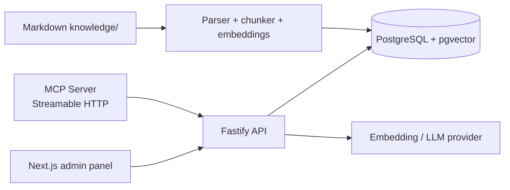

# HookLens architecture

The API owns delivery state and data redaction. The MCP server never queries the
database directly; it uses the API and therefore inherits the same authorization,
validation and audit trail. The default embedding provider is deterministic so a
portfolio demo works without an external API key. Set `EMBEDDING_PROVIDER=openai`
to use a hosted embedding model.

The Docker database listens on host port `5433`; PostgreSQL continues to listen
on `5432` inside the container.
