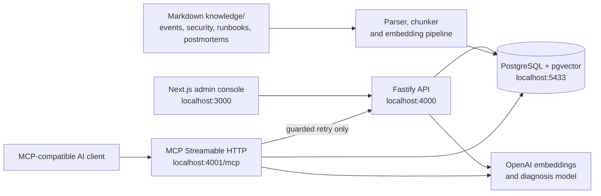
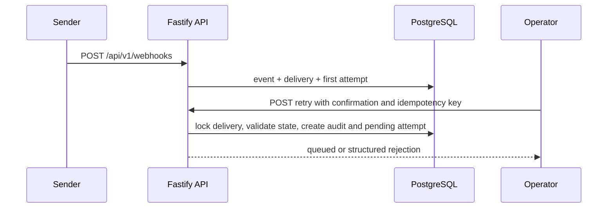
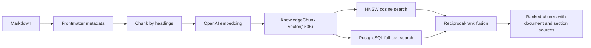
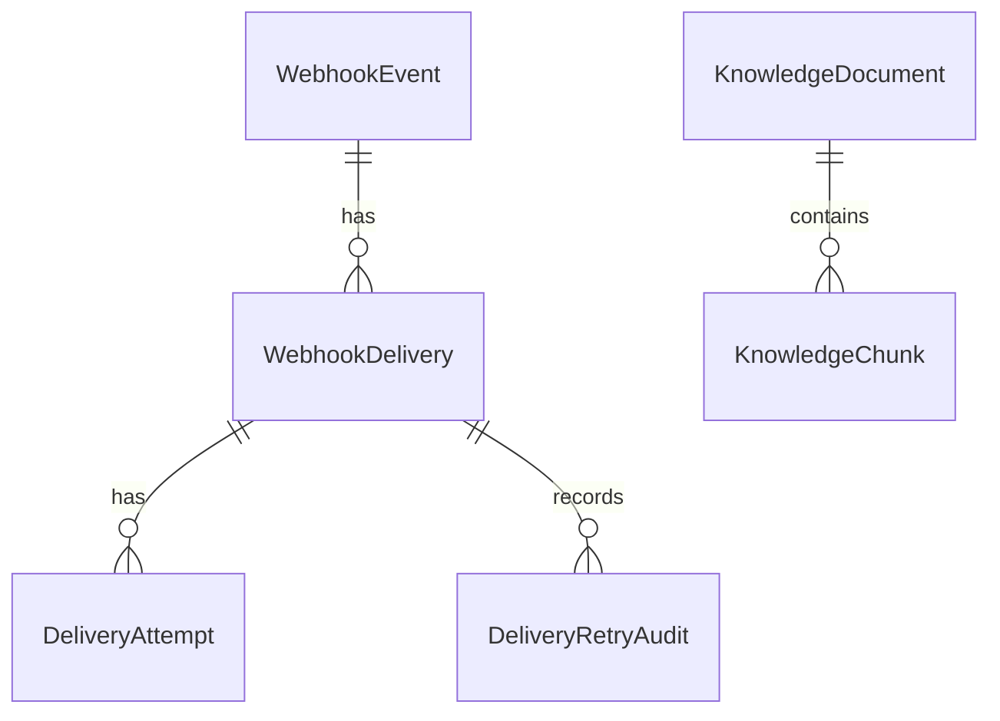

# Architecture

## System overview

HookLens has three independently runnable application processes and one Docker
service. The browser never receives a database connection string, an OpenAI key
or the MCP operator setting.

| Component  | Responsibility                                                                                                              | Local address                 |
| ---------- | --------------------------------------------------------------------------------------------------------------------------- | ----------------------------- |
| `apps/web` | Next.js administration console for deliveries, diagnosis, knowledge and MCP capabilities.                                   | `127.0.0.1:3000`              |
| `apps/api` | Fastify REST API, browser CORS boundary, delivery intake, retry rules and API-side redaction.                               | `127.0.0.1:4000`              |
| `apps/mcp` | MCP resources, tools and prompts over Streamable HTTP. Read tools query the database through their own redacted repository. | `127.0.0.1:4001`              |
| PostgreSQL | Operational data, documents, chunks, pgvector embeddings and full-text index.                                               | host `5433`, container `5432` |

## Ownership boundaries

The API owns the browser-facing delivery workflow. It validates REST input with
Zod, applies CORS for configured local web origins, and redacts delivery data
before it reaches the Next.js application.

The MCP server has its own read-only Prisma repository and redaction layer so
that an MCP client can inspect records without requiring the Fastify process.
The single MCP write operation, `retry_webhook_delivery`, delegates to the API
instead of duplicating retry authorization, idempotency and audit rules.

Both the API and MCP server use the same PostgreSQL data and OpenAI-backed
retrieval approach. MCP is deliberately bound to loopback and validates local
host and origin headers; it is a local demo integration point, not a deployed
multi-tenant service.

## Main data flows

### Webhook capture and retry

Retries require the development-only `operator` role, `confirmed: true`, a UUID
idempotency key, a failed delivery and fewer than three prior retries. The retry
is intentionally queued only; no external request is sent.

### Knowledge ingestion and retrieval

Each Markdown document has a title, category and related event types. Ingestion
stores a checksum, embedding model and status so unchanged documents can be
skipped on later runs. Retrieval combines semantic and lexical rankings, then
applies event-type and category filters before returning the strongest chunks.

### Failure diagnosis

For a failed delivery, HookLens creates a retrieval query from the event type,
HTTP status, receiver response and attempt count. It retrieves up to five
knowledge chunks, builds a model context and redacts credentials, secret-shaped
fields, bearer tokens and URL query strings first. The language model returns a
diagnosis, while the API returns sources derived from retrieval results rather
than model-generated citations.

## Data model

Operational records preserve the original event, delivery state and attempt
timeline. Knowledge documents store source metadata; chunks additionally store
heading section, token estimate, embedding metadata and a 1536-dimension vector.

## Related documents

- [Project structure](project-structure.md)
- [API and MCP reference](api-and-mcp.md)
- [Technical decisions](technical-decisions.md)
